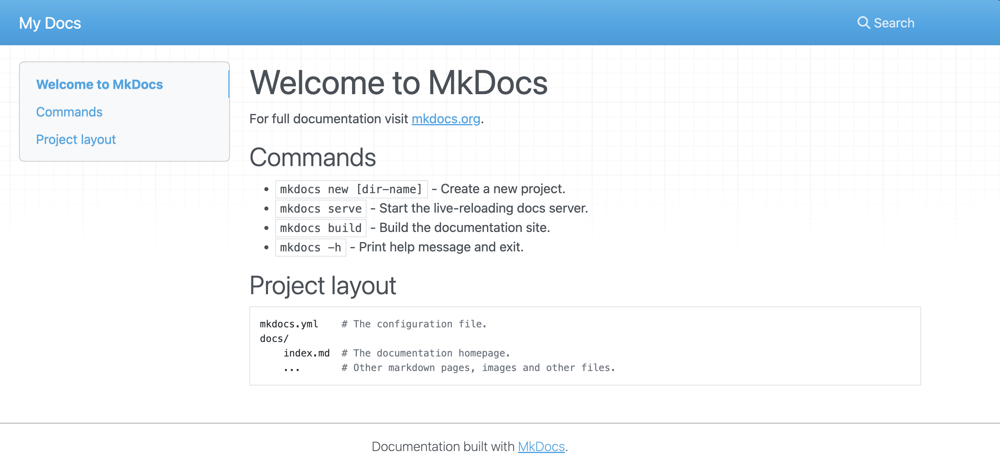

# 1. Setup Basic Site

## 1.1 Installation

When you "instantiate" this template you get a pre-built starter project using mkdocs.yml that contains all the necessary configuration and customization required to make it usable. In _this_ workshop, we look under the hood to see how we got there from scratch.

It all starts with installing [mkdocs-material](https://squidfunk.github.io/mkdocs-material/tutorials/blogs/basic/?h=blog) - in our case, this is done by the `devcontainer.json` file which defines a Python development environment **and** installs package dependencies specified in `requirements.txt`. In our case that last file contains `mkdocs-material`. **So launching the repository from GitHub Codespaces or with Docker Desktop** gives you a development environment ready for mkdocs.

## 1.2 Initialization

The next step after that is to _scaffold a new site_. This is done with the following command:

```bash title=""
mkdocs new .
```

This creates a default `mkdocs.yml` file with this single line:

```yml title="mkdocs.yml"
site_name: My Docs
```

You can then preview what this site will look like by using the following command in the VS Code Terminal, at the root of the repo:

```bash title=""
mkdocs serve
```

You will then see something like this. Note that this is using the basic mkdocs-material theme but does not have any customization (yet).



## 1.3 Congratulations!

You have the basic mkdocs-material website running locally. Let's start taking steps to customize this, next.

---